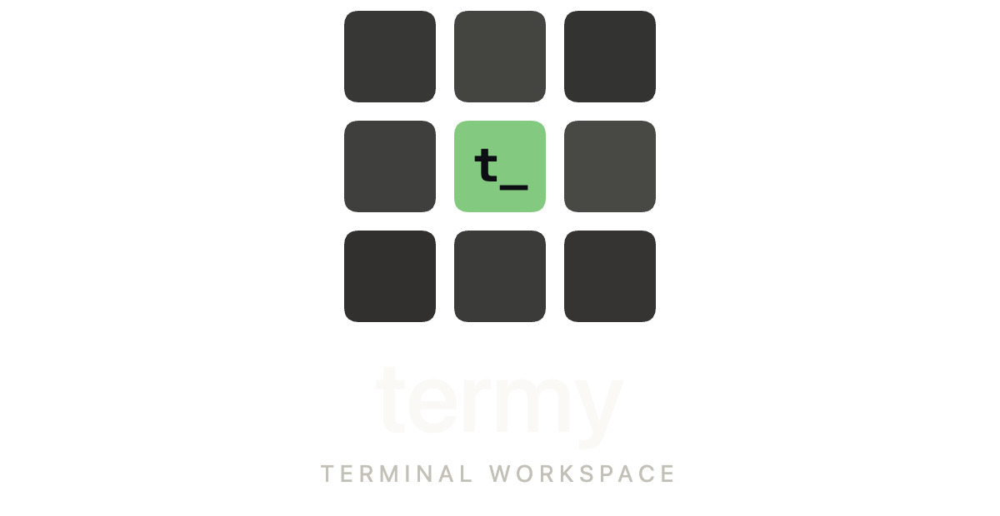

<p align="center">
  
</p>

<p align="center">
  A terminal workspace built with Electron, React, and xterm.js.
</p>

---

## Install

Requires [Node.js](https://nodejs.org) (v18+) and Git.

```bash
git clone https://github.com/GoalieSave25/termy.git
cd termy
npm run setup
```

This installs dependencies, builds the app, and adds it to `/Applications`. Once done, open Termy from Spotlight (Cmd+Space) or your dock.

## Auto-Updates

Termy checks for updates on launch. When new commits are available on `main`, you'll be prompted to update. The app will quit, pull the latest code, rebuild, and relaunch automatically.

You can also check manually from the menu bar: **Termy > Check for Updates...**

## Development

```bash
npm start
```

Runs the app in development mode with hot reload.

## License

MIT
